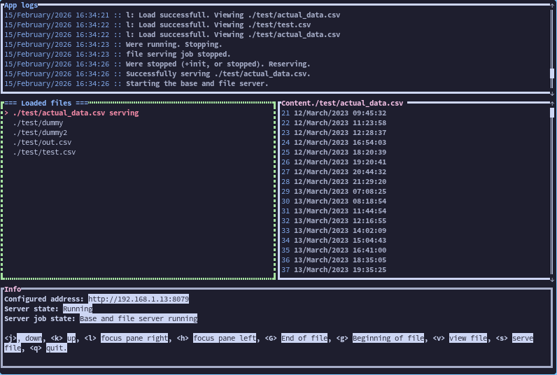

# `Watch app import/export helper`

`CLI` and `TUI` helper to run a web server for serving and receiving water intakes data
for import/export purposes.

[Android app](https://github.com/RomaricKc1/WaterReminder.git)



## Serving routes

- `/` -> Returns `Hello, World!`
- `/ping` -> Returns `Pong`
- `/put_intakes` -> Reads the file the app is sending: `Export from the app`
- `/get_intakes` -> Serve a file to the app: `Import from the app`

## Example of the put_intakes post request

```bash
curl -i -X POST -H 'Content-Type: application/json' -d        \
'{"line": "1,176719613900\n1,176719612900\n1,176719611900"}'  \
http://localhost:8079/put_intakes
```

